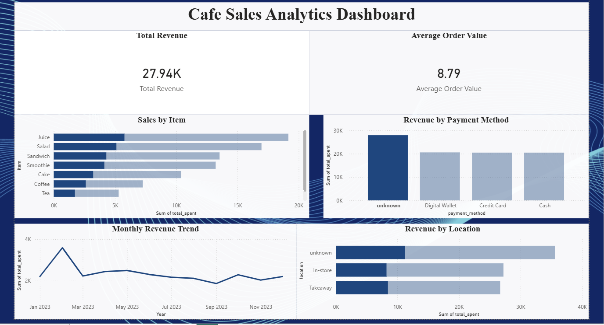

# Cafe Sales Analytics Project

## Overview
This project is an end-to-end data analytics solution built using Python, MySQL, and Power BI. It includes data cleaning, SQL analysis, and dashboard reporting.

## Business Objective
The goal of this project was to analyze cafe transaction data and generate insights on revenue, item performance, payment behavior, sales trends, and location performance.

## Tools Used
- Python
- Pandas
- NumPy
- MySQL
- Power BI
- Jupyter Notebook

## Project Workflow
1. Cleaned raw cafe sales data using Python
2. Standardized column names and handled missing values
3. Replaced invalid placeholder values
4. Converted numeric columns and validated totals
5. Removed duplicate rows and duplicate transaction IDs
6. Loaded cleaned data into MySQL
7. Performed SQL analysis on revenue and trends
8. Built an interactive Power BI dashboard

## Key Insights
- Total revenue was approximately 27.94K
- Average order value was 8.79
- Juice was the top revenue-generating item
- February had the highest monthly revenue
- Unknown payment and location values highlighted data quality issues

## Files Included
- `data/dirty_cafe_sales.csv`
- `data/cleaned_cafe_sales.csv`
- `notebooks/clean_cafe_sales.ipynb`
- `scripts/cafe_sales_data_cleaning.py`
- `sql/cafe_sales_analysis.sql`

## Outcome
This project demonstrates skills in data cleaning, SQL analysis, data validation, and dashboard development in a real-world analytics workflow.
## Dashboard Preview

